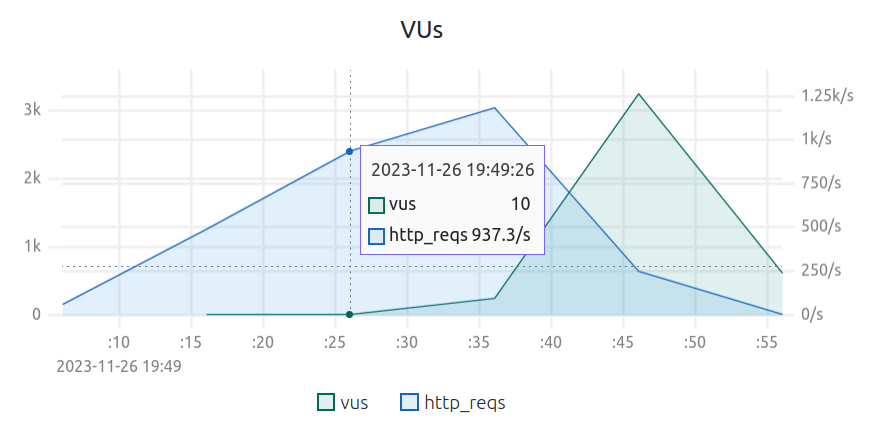
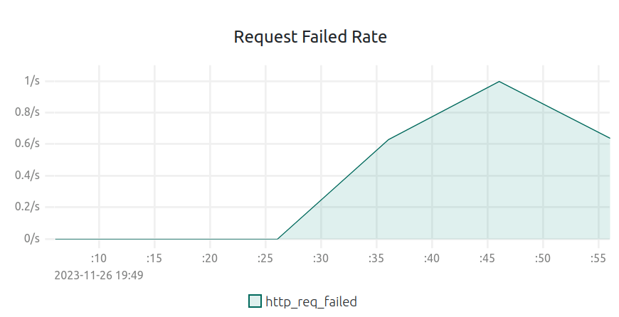

Использовал k6.

## Профиль нагрузки системы
### Load test (для проверки соответствия SLO)
RPS линейно растёт с 1 до 400 за 30с, затем 400 в течение 30с.
### Capacity test (для определения максимальной производительности без нарушения SLO)
RPS линейно растёт с 1 до 1500 за 30с, затем 1500 в течение 5с.

## Требования производительности к системе (SLO/SLA)
### SLA
При RPS=400:
- Частота неудачных запросов < 0,1%/c
- 95 перцентиль от времени длительности запроса < 300мс
### SLO
При RPS=400:
- Частота неудачных запросов < 0,05%/c
- 95 перцентиль от времени длительности запроса < 200мс

## Максимальная производительность системы
Из графиков ниже видно, что SLO начинают нарушаться при RPS около 900:

